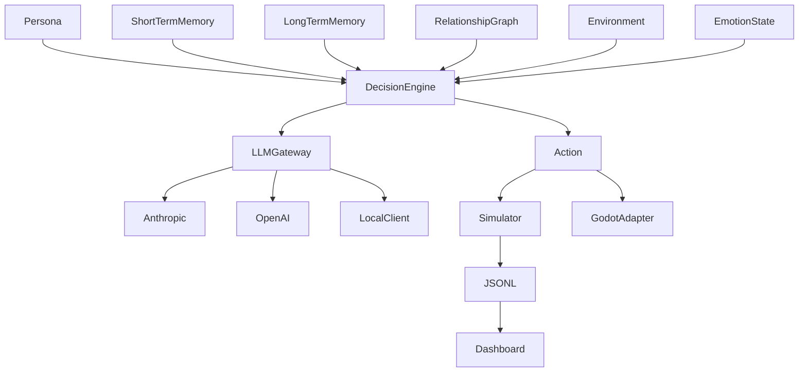

# Knoema Engine

> LLM-based multi-agent social simulation engine for games, public safety research, and academic simulation.

[](https://github.com/Celovin/knoema/actions/workflows/ci.yml)
[](LICENSE)
[](https://www.python.org/downloads/)
[](https://huggingface.co/spaces/celovin/knoema-playground)
[](https://doi.org/10.5281/zenodo.19643409)
[](paper/main.tex)
[](docs/research/papers_with_code_submission.md)

## Current version

0.2.0

## Languages

| English | 한국어 | 日本語 | 简体中文 | 繁體中文 | Deutsch | Français | Español |
| --- | --- | --- | --- | --- | --- | --- | --- |
| [English](README.md) | [한국어](README.ko.md) | [日本語](README.ja.md) | [简体中文](README.zh-CN.md) | [繁體中文](README.zh-TW.md) | [Deutsch](README.de.md) | [Français](README.fr.md) | [Español](README.es.md) |

Knoema Engine is an early MVP for modeling persistent agents with memory, relationships, emotions, environment context, and LLM-backed decisions. The same runtime can support narrative NPCs, fictional public-safety replay research, and reproducible agent-based social simulation.

All public-safety examples in this repository are fictional, synthetic, and non-identifying. They are replay and research demos, not crime prediction or suspect scoring tools.

## Applications

| Domain | Use | Current MVP Surface |
| --- | --- | --- |
| Games | Persistent-memory NPCs and dynamic dialogue | Godot adapter scaffold and NPC notebook |
| Public safety research | Fictional scenario replay for prevention research | Synthetic replay notebook with milestone coverage |
| Academic research | Reproducible LLM-based agent simulation | Python package, notebooks, Streamlit dashboard |

## Core Features

- Personas with Big Five personality traits, values, goals, and prompt rendering
- Short-term memory buffers and SQLite + FAISS long-term retrieval with semantic-temporal reranking
- Relationship graph with directed trust, familiarity, and interaction weight
- Environment context for time, location, conditions, and recent events
- PAD emotion state: valence, arousal, dominance
- Opt-in hierarchical planning for multi-step agent goals
- Opt-in social learning for observational imitation and skill propagation
- Optional distributed 1000-agent execution envelope with Ray-compatible fallback
- LLM gateway with Anthropic, OpenAI, and deterministic local clients
- Prompt templates for English, Korean, Japanese, and Chinese runs
- Simulation runner with scheduled events and JSONL export
- `knoema run` CLI for YAML-driven local simulations
- Scenario DSL v1 for validated YAML scenarios and ethics guardrails
- Opt-in red-team content filter and append-only safety audit log helpers
- Jupyter notebooks for MVP demo tracks and a 10-agent village scale-up
- 50-agent deterministic village experiment with committed metrics, trace sample, and PDF report
- Gradio Playground for no-key replay demos and user-supplied LLM API keys
- Deterministic benchmark scripts with JSON, Markdown, SVG figures, and PDF reports
- Cross-framework comparison benchmark against AutoGen, CrewAI, LangGraph, Mesa, and NetLogo
- Human evaluation framework with survey templates, a static review UI, and reliability metrics
- Cloud deployment templates for AWS, GCP, and Azure production planning
- Godot 4 adapter scaffold
- Unity 2022 LTS adapter scaffold for Package Manager Git installs
- Game SDK facades for Python, TypeScript, and GDScript NPC integrations
- Mobile SDK scaffolds for iOS Swift Package Manager and Android Kotlin clients
- Browser-side static runtime for no-server 2-agent, 5-agent, and Sally-Anne demos
- Interactive 5-chapter tutorial website with embedded code editing and progress tracking
- VS Code Scenario DSL extension scaffold with syntax highlighting and validation
- Streamlit dashboard for inspecting simulation logs with playback and live-tail controls
- Research SaaS dashboard scaffold for experiment comparison, memory inspection, cost budget, and citation export

## Install

```bash
pip install -e ".[dev]"
```

Dashboard dependencies are optional:

```bash
pip install -e ".[dashboard]"
```

## Minimal Simulation

```python
from datetime import datetime

from knoema import Environment, LocalClient, Persona, Personality, Simulator

alice = Persona(
    agent_id="alice",
    name="Alice",
    age=17,
    background="Introverted literature student in a dormitory.",
    personality=Personality(
        openness=0.8,
        conscientiousness=0.6,
        extraversion=0.2,
        agreeableness=0.7,
        neuroticism=0.4,
    ),
    values=["privacy", "honesty"],
    goals=["finish a short story"],
)

bob = Persona(
    agent_id="bob",
    name="Bob",
    age=17,
    background="Extroverted science student in the same dormitory.",
    personality=Personality(
        openness=0.6,
        conscientiousness=0.8,
        extraversion=0.9,
        agreeableness=0.7,
        neuroticism=0.3,
    ),
    values=["curiosity", "teamwork"],
    goals=["prepare for a physics contest"],
)

environment = Environment(
    start_time=datetime(2026, 3, 2, 9, 0),
    location_path=("Korea", "Seoul", "High School Dormitory", "Room 201"),
)

sim = Simulator(
    agents=[alice, bob],
    environment=environment,
    tick_duration_minutes=30,
    llm=LocalClient(
        lambda messages: '{"action_type": "speak", "target": null, "content": "observes the room."}'
    ),
)

logs = sim.run(duration_days=1)
sim.export_logs("runs/dorm_001.jsonl")
```

## Examples

- [Two-Agent Dormitory](examples/01_two_agents_dorm.ipynb): two students sharing a dorm room over seven simulated days
- [Fictional Crime Scenario Replay](examples/02_crime_scenario_replay.ipynb): synthetic replay workflow with milestone coverage
- [Game NPC Persistent Memory Demo](examples/03_game_npc_demo.ipynb): NPC memory retrieval and Godot-style payload
- [Ten-Agent Village Simulation](examples/04_village.ipynb): deterministic 10-person village run with relationship and JSONL checks
- [Ollama Local LLM Fallback](examples/05_ollama_local_fallback.ipynb): local-first gateway example with deterministic fallback
- [Live Ollama Five-Agent Demo](examples/05_live_ollama_demo.ipynb): seeded `llama3.1:8b` notebook run with a 30-second live cap

Run notebooks top-to-bottom after installing `.[dev]`.

## Playground

Try the browser demo at [Knoema Playground](https://huggingface.co/spaces/celovin/knoema-playground).

The Playground includes three prebuilt scenarios, a deterministic replay-only mode that needs no API key, optional OpenAI or Anthropic runs with a user-supplied per-session API key, a timeline view, an interactive relationship graph, and JSONL log download.

Quick start demos:

- `Office team conflict`: the default first-run demo with visible tension, negotiation, and relationship updates after one click.
- `Dorm: two agents`: the fastest compact demo for a two-person interaction loop.
- `Village: ten agents`: the best stress case for dense relationship graph movement.

Local run:

```bash
pip install -r playground/requirements.txt
python playground/app.py
```

Space deploy helper:

```bash
python scripts/deploy_playground_space.py
```

## Website

```bash
cd website
npm install
npm run build
npm run dev
```

The website is a Next.js app for the public project surface: application tracks, SDK entry points, research reports, and launch links.

The scenario editor is available at `/editor` and supports drag-and-drop agents, timeline edits, live YAML preview, and Scenario DSL export.

## API Server

```bash
pip install -e ".[api]"
uvicorn knoema.api.server:app --host 127.0.0.1 --port 8000
```

The API server provides REST routes for simulation lifecycle management, agent inspection, event injection, and a WebSocket log stream for live tick delivery.

API references:

- [REST Reference](docs/api/rest-reference.md)
- [WebSocket Guide](docs/api/websocket-guide.md)
- [Example Notebook](examples/07_api_usage.ipynb)

Docker Compose example:

```bash
docker compose -f deploy/docker/docker-compose.yml --env-file deploy/docker/.env.example up -d
curl http://localhost:8000/healthz
```

## Documentation Site

```bash
pip install -e ".[docs]"
mkdocs build
mkdocs serve
```

The MkDocs site organizes getting-started guides, API reference pages, game and research workflows, CLI reference, and community docs. Start at [docs/index.md](docs/index.md).

## Dashboard

```bash
pip install -e ".[dashboard]"
streamlit run dashboard/app.py
```

Open `http://localhost:8501`, then load a JSONL file produced by `Simulator.export_logs(...)` or use the bundled sample.

## Research SaaS

```bash
pip install -r saas/requirements.txt
streamlit run saas/app.py
```

The research dashboard includes six pages for simulation runs, A/B comparison, memory inspection, relationship exploration, cost budgeting, and citation export.

## Benchmarks

```bash
python benchmarks/run_benchmark.py --json-output runs/benchmark.json --markdown-output runs/benchmark.md
```

The benchmark report records measured Knoema throughput and transparent `not-measured` comparison slots for Concordia and Mesa. See [benchmarks/README.md](benchmarks/README.md) for comparison discipline.

Phase 19 scale experiment:

```bash
python experiments/50_agent_village/run.py
```

Classic reproductions:

```bash
python experiments/schelling_segregation/run.py
python experiments/axelrod_prisoners_dilemma/run.py
```

See [50-Agent Village Experiment](experiments/50_agent_village/README.md) and [50-Agent Benchmark Report](docs/reports/50_agent_benchmark.pdf).

Formal report bundle:

```bash
python benchmarks/formal_report/runner.py
```

See [Formal Benchmark Report](benchmarks/formal_report/README.md) and [Formal Report PDF](benchmarks/formal_report/report.pdf).

Phase 46 scoring bundle:

```bash
python benchmarks/scoring/runner.py
```

See [Scoring Benchmarks](benchmarks/scoring/README.md).

## Reproducibility Guarantees

Knoema deterministic local runs can be replayed from fixed config, seed, and JSONL artifacts. The Phase 21 test suite covers repeated same-seed runs, seed propagation, YAML config round-trip, and JSONL replay summaries.

See [Reproducibility Report](docs/reports/reproducibility.md).

## Memory Retrieval

`SQLiteFaissMemoryStore.retrieve(...)` keeps the simple list-of-memory API. Use `retrieve_with_scores(...)` when you need semantic score, temporal score, importance score, and final reranking score for analysis:

```python
from knoema import RetrievalWeights

results = store.retrieve_with_scores(
    "shared study routine",
    k=5,
    weights=RetrievalWeights(semantic=0.65, temporal=0.30, importance=0.05),
)
```

## CLI

```bash
knoema run examples/cli_dorm.yaml --json
knoema score experiments/50_agent_village/results/sim_log.jsonl
```

`knoema score` emits JSON summaries for Persona Consistency Score (PCS) and Relationship Coherence Score (RCS) from a committed JSONL log.

See [CLI](docs/cli.md) for the YAML config shape, output path rules, dry-run validation, and scoring mode.

## Scenario DSL

```python
from knoema.dsl import load_scenario

scenario = load_scenario("examples/scenarios/01_shopkeeper_winter_crime.yaml")
logs = scenario.to_simulator().run(duration_days=scenario.duration_days)
```

See [DSL Tutorial](docs/dsl/tutorial.md), [DSL Reference](docs/dsl/reference.md), and [Scenario JSON Schema](schemas/scenario_v1.json).

The Phase 48 marketplace library includes 50 fictional Scenario DSL examples across school, workplace, family, community, and social-experiment categories:

```bash
knoema validate scenarios/library --json
```

See [Scenario Library](scenarios/library/INDEX.md).

## Game SDK

Knoema includes deterministic NPC SDK facades for installed Python packages, TypeScript tooling, and direct Godot GDScript prototypes.

```python
from knoema.game import GameSession

session = GameSession(game_id="demo-village")
npc = session.create_npc(
    persona_file="sdk/python/examples/personas/shopkeeper.yaml",
    initial_relationships={"player": "neighbor"},
)
response = npc.interact("asks about the lantern market", context={"location": "Harbor Village"})
print(response.text)
```

Run the Python example after installing the package in editable mode:

```bash
python sdk/python/examples/basic_npc.py
```

SDK references:

- [Python Game SDK](docs/sdk/python-api.md)
- [TypeScript Game SDK](docs/sdk/typescript-api.md)
- [Godot GDScript Game SDK](docs/sdk/godot-api.md)
- [Game SDK Integration Patterns](docs/sdk/integration_patterns.md)

## Godot Integration

See [adapters/godot/README.md](adapters/godot/README.md) for the Godot 4 scaffold, HTTP/local fallback client, and demo scene structure.

Open the actual Godot project with:

```bash
godot4 --path adapters/godot
```

After adding a `Web` export preset in the Godot editor, create a real web export with:

```bash
godot4 --headless --path adapters/godot --export-release Web build/godot-tavern/index.html
```

## Unity Integration

Install the Unity adapter with Package Manager:

```text
https://github.com/Celovin/knoema.git?path=adapters/unity
```

See [adapters/unity/README.md](adapters/unity/README.md) for the Unity 2022.3 LTS package scaffold, HTTP/local fallback client, `NPCAgent` component, and Basic NPC sample.

Open the host Unity project with:

```text
"C:\Program Files\Unity\Hub\Editor\2022.3.xx\Editor\Unity.exe" -projectPath <your-project>
```

For a real WebGL build, add a small Editor build method in the host project and call it with:

```text
"C:\Program Files\Unity\Hub\Editor\2022.3.xx\Editor\Unity.exe" -batchmode -projectPath <your-project> -executeMethod TavernDemoBuild.BuildWebGL -quit -logFile Logs\unity-webgl-build.log
```

## Unreal Integration

Copy [adapters/unreal](adapters/unreal) into either your project `Plugins` folder or the UE 5.3 engine `Marketplace` plugins folder, then enable the `Knoema Unreal` plugin in the editor.

See [adapters/unreal/README.md](adapters/unreal/README.md) for the UE5 source plugin scaffold, REST API client, `NPCAgentComponent`, and `BP_BasicNPC` placeholder flow.

## Architecture



Detailed notes:

- [Architecture](docs/architecture.md)
- [Research Positioning](docs/research.md)
- [Competitor Matrix](docs/competitor_matrix.md)
- [50-Agent Village Experiment](experiments/50_agent_village/README.md)
- [50-Agent Benchmark Report](docs/reports/50_agent_benchmark.pdf)
- [Formal Benchmark Report](benchmarks/formal_report/README.md)
- [Formal Report PDF](benchmarks/formal_report/report.pdf)
- [Reproducibility Report](docs/reports/reproducibility.md)
- [DSL Tutorial](docs/dsl/tutorial.md)
- [DSL Reference](docs/dsl/reference.md)
- [KNOT Episode 1 Integration Case Study](docs/case_studies/01_knot_episode_1_integration.md)
- [Korean University Pilot Case Study](docs/case_studies/02_korean_university_pilot.md)
- [Indie Studio Adoption Case Study](docs/case_studies/03_indie_studio_adoption.md)
- [Scenario Marketplace Beta](scenarios_hub/README.md)
- [Python Game SDK](docs/sdk/python-api.md)
- [TypeScript Game SDK](docs/sdk/typescript-api.md)
- [Godot GDScript Game SDK](docs/sdk/godot-api.md)
- [Game SDK Integration Patterns](docs/sdk/integration_patterns.md)
- [Research SaaS App](saas/app.py)
- [Security Policy](docs/SECURITY.md) and [Phase 34 Security Audit](docs/security/audit_2026-04-18.md)
- [Privacy](docs/PRIVACY.md)
- [CLI](docs/cli.md)
- [Prompt Templates](docs/prompts.md)
- [Local vs Cloud LLM Fallback Notes](src/knoema/llm/local/benchmarks/local_vs_cloud.md)
- [Tutorial Blog Draft](docs/tutorial_blog.md)
- [Korean Technical Blog Drafts](docs/blog/ko/01-why-knoema-korean-indie-games.md)
- [Discord Community Launch Kit](docs/discord_community.md)
- [Demo Video Scripts](docs/videos/shotlist.md)
- [YouTube Tutorial Scripts](docs/videos/tutorials/01_getting_started_10min.md)
- [Hugging Face Playground Guide](playground/README.md)
- [Website App](website/app/page.tsx)
- [Technical Report Draft](paper/main.tex) and [PDF Preview](paper/knoema_technical_report.pdf)
- [arXiv v2 Preprint Source](paper/main.tex), [Appendix](paper/appendix.tex), and [80+ References](paper/references.bib)
- [Papers with Code Submission Packet](docs/research/papers_with_code_submission.md) and [machine-readable packet](docs/research/papers_with_code_submission.json)
- [Academic Indexing Packet](docs/research/academic-indexing.md), [Citation Metadata](CITATION.cff), and [Zenodo Metadata](.zenodo.json)

## Roadmap

| Version | Target | Milestones |
| --- | --- | --- |
| v0.1 | 2026 Q2 | Core MVP, notebooks, Godot scaffold, dashboard |
| v0.5 | 2027 Q2 | Domain adapters, hosted dashboard, research pilots |
| v1.0 | 2027 Q4 | Production SDK, commercial game integration, SaaS release |

## Development

```bash
pytest
ruff check .
mypy src
```

See [CONTRIBUTING.md](CONTRIBUTING.md).

## Release Prep

Local package and Docker release checks are documented in [RELEASE.md](RELEASE.md). CI and release automation are documented in [CI and Release Automation](docs/ci-release-automation.md). The repository includes Release Please version PRs and a tag-triggered GitHub Release workflow with PyPI Trusted Publishing gated by the `pypi` environment. Use `python scripts/external_activation_status.py` before external activation steps to confirm release and deployment blockers plus suggested next actions in one JSON snapshot, `python scripts/deploy_playground_space.py` once Hugging Face auth is ready, or `python scripts/pre_release_check.py --version 0.2.0` to combine activation status with a local release dry run.

## License

MIT License. Copyright (c) 2026 Celovin.
