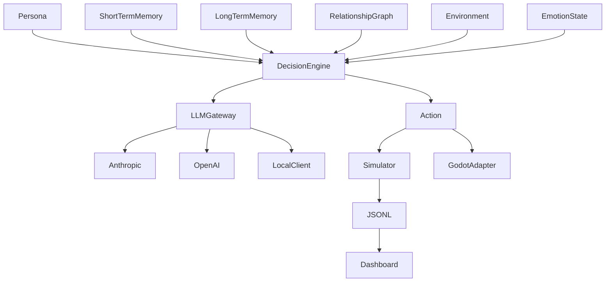

# Knoema Engine

> LLM-based multi-agent social simulation engine for games, public safety research, and academic simulation.

[](https://github.com/Celovin/knoema/actions/workflows/ci.yml)
[](LICENSE)
[](https://www.python.org/downloads/)

Korean: [README.ko.md](README.ko.md)

Knoema Engine is an early MVP for modeling persistent agents with memory, relationships, emotions, environment context, and LLM-backed decisions. The same runtime can support narrative NPCs, fictional public-safety replay research, and reproducible agent-based social simulation.

All public-safety examples in this repository are fictional, synthetic, and non-identifying. They are replay and research demos, not crime prediction or suspect scoring tools.

## Applications

| Domain | Use | Current MVP Surface |
| --- | --- | --- |
| Games | Persistent-memory NPCs and dynamic dialogue | Godot adapter scaffold and NPC notebook |
| Public safety research | Fictional scenario replay for prevention research | Synthetic replay notebook with milestone coverage |
| Academic research | Reproducible LLM-based agent simulation | Python package, notebooks, Streamlit dashboard |

## Core Features

- Personas with Big Five personality traits, values, goals, and prompt rendering
- Short-term memory buffers and SQLite + FAISS long-term retrieval
- Relationship graph with directed trust, familiarity, and interaction weight
- Environment context for time, location, conditions, and recent events
- PAD emotion state: valence, arousal, dominance
- LLM gateway with Anthropic, OpenAI, and deterministic local clients
- Prompt templates for English, Korean, Japanese, and Chinese runs
- Simulation runner with scheduled events and JSONL export
- Jupyter notebooks for MVP demo tracks and a 10-agent village scale-up
- Deterministic benchmark script with JSON and Markdown reports
- Godot 4 adapter scaffold
- Streamlit dashboard for inspecting simulation logs

## Install

```bash
pip install -e ".[dev]"
```

Dashboard dependencies are optional:

```bash
pip install -e ".[dashboard]"
```

## Minimal Simulation

```python
from datetime import datetime

from knoema import Environment, LocalClient, Persona, Personality, Simulator

alice = Persona(
    agent_id="alice",
    name="Alice",
    age=17,
    background="Introverted literature student in a dormitory.",
    personality=Personality(
        openness=0.8,
        conscientiousness=0.6,
        extraversion=0.2,
        agreeableness=0.7,
        neuroticism=0.4,
    ),
    values=["privacy", "honesty"],
    goals=["finish a short story"],
)

bob = Persona(
    agent_id="bob",
    name="Bob",
    age=17,
    background="Extroverted science student in the same dormitory.",
    personality=Personality(
        openness=0.6,
        conscientiousness=0.8,
        extraversion=0.9,
        agreeableness=0.7,
        neuroticism=0.3,
    ),
    values=["curiosity", "teamwork"],
    goals=["prepare for a physics contest"],
)

environment = Environment(
    start_time=datetime(2026, 3, 2, 9, 0),
    location_path=("Korea", "Seoul", "High School Dormitory", "Room 201"),
)

sim = Simulator(
    agents=[alice, bob],
    environment=environment,
    tick_duration_minutes=30,
    llm=LocalClient(
        lambda messages: '{"action_type": "speak", "target": null, "content": "observes the room."}'
    ),
)

logs = sim.run(duration_days=1)
sim.export_logs("runs/dorm_001.jsonl")
```

## Examples

- [Two-Agent Dormitory](examples/01_two_agents_dorm.ipynb): two students sharing a dorm room over seven simulated days
- [Fictional Crime Scenario Replay](examples/02_crime_scenario_replay.ipynb): synthetic replay workflow with milestone coverage
- [Game NPC Persistent Memory Demo](examples/03_game_npc_demo.ipynb): NPC memory retrieval and Godot-style payload
- [Ten-Agent Village Simulation](examples/04_village.ipynb): deterministic 10-person village run with relationship and JSONL checks

Run notebooks top-to-bottom after installing `.[dev]`.

## Dashboard

```bash
pip install -e ".[dashboard]"
streamlit run dashboard/app.py
```

Open `http://localhost:8501`, then load a JSONL file produced by `Simulator.export_logs(...)` or use the bundled sample.

## Benchmarks

```bash
python benchmarks/run_benchmark.py --json-output runs/benchmark.json --markdown-output runs/benchmark.md
```

The benchmark report records measured Knoema throughput and transparent `not-measured` comparison slots for Concordia and Mesa. See [benchmarks/README.md](benchmarks/README.md) for comparison discipline.

## Godot Integration

See [adapters/godot/README.md](adapters/godot/README.md) for the Godot 4 scaffold, HTTP/local fallback client, and demo scene structure.

## Architecture



Detailed notes:

- [Architecture](docs/architecture.md)
- [Research Positioning](docs/research.md)
- [Prompt Templates](docs/prompts.md)
- [Technical Report Draft](paper/main.tex) and [PDF Preview](paper/knoema_technical_report.pdf)

## Roadmap

| Version | Target | Milestones |
| --- | --- | --- |
| v0.1 | 2026 Q2 | Core MVP, notebooks, Godot scaffold, dashboard |
| v0.5 | 2027 Q2 | Domain adapters, hosted dashboard, research pilots |
| v1.0 | 2027 Q4 | Production SDK, commercial game integration, SaaS release |

## Development

```bash
pytest
ruff check .
mypy src
```

See [CONTRIBUTING.md](CONTRIBUTING.md).

## Release Prep

Local package and Docker release checks are documented in [RELEASE.md](RELEASE.md). The repository includes a tag-triggered GitHub Release workflow, but PyPI publishing is intentionally left as a manual approval step.

## License

MIT License. Copyright (c) 2026 Celovin.
