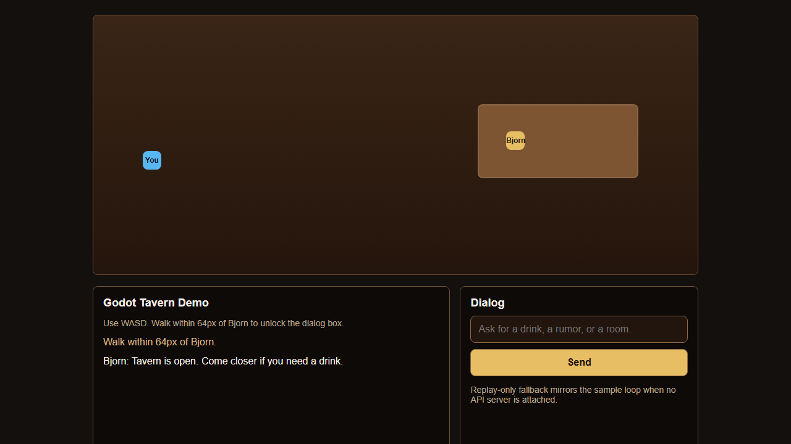
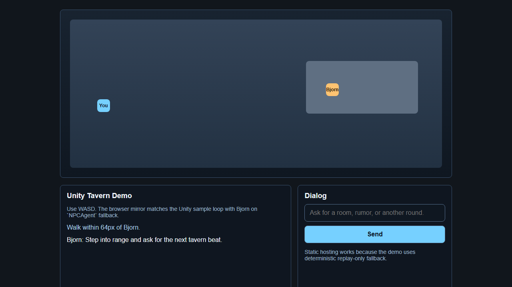

# Game Demos

Knoema ships two public tavern demo paths for engine-facing review:

1. `adapters/godot/samples/tavern_demo/tavern_demo.tscn`
2. `adapters/unity/Samples~/TavernDemo/Scenes/TavernDemo.unity`

Both samples keep the same loop:

- WASD movement
- walk within 64px of Bjorn
- type a line
- receive a replay-only fallback response when no API server is attached

The two `web_build/index.html` mirrors are DOM simulations for adapter review. They are not real Godot or Unity engine exports.

## Run the API server

```bash
uvicorn knoema.api.server:app --host 127.0.0.1 --port 8000
```

The demos still work without the server because the adapters keep deterministic fallback enabled.

## Godot tavern demo

1. Open `adapters/godot` in Godot 4.
2. Open `samples/tavern_demo/tavern_demo.tscn`.
3. Press Play.
4. Move with `W`, `A`, `S`, `D`.
5. Walk within 64px of Bjorn.
6. Type a message and press `Send`.

The sample script uses `res://scripts/knoema_client.gd`, injects tavern context JSON, and mirrors the same loop in `adapters/godot/samples/tavern_demo/web_build/index.html`.

Open the real Godot project with:

```bash
godot4 --path adapters/godot
```

After adding a `Web` export preset in the editor, build a real export with:

```bash
godot4 --headless --path adapters/godot --export-release Web build/godot-tavern/index.html
```



## Unity tavern demo

1. Open the Unity 2022.3 LTS editor.
2. Import `Samples~/TavernDemo` from the `com.celovin.knoema` package.
3. Open `Samples~/TavernDemo/Scenes/TavernDemo.unity`.
4. Press Play.
5. Move with `W`, `A`, `S`, `D`.
6. Walk within 64px of Bjorn and send a line through the dialog box.

The sample uses `NPCAgent`, `TavernDemo.cs`, and `TavernPlayerController.cs`. The browser mirror lives at `adapters/unity/Samples~/TavernDemo/web_build/index.html`.

Open the host Unity project with:

```text
"C:\Program Files\Unity\Hub\Editor\2022.3.xx\Editor\Unity.exe" -projectPath <your-project>
```

For a real WebGL build, add an Editor build method in the host project and invoke:

```text
"C:\Program Files\Unity\Hub\Editor\2022.3.xx\Editor\Unity.exe" -batchmode -projectPath <your-project> -executeMethod TavernDemoBuild.BuildWebGL -quit -logFile Logs\unity-webgl-build.log
```



## Browser review

The website embeds both browser builds at `/game-demos`. This keeps the demo path available even when Godot or Unity is not installed on the review machine.
