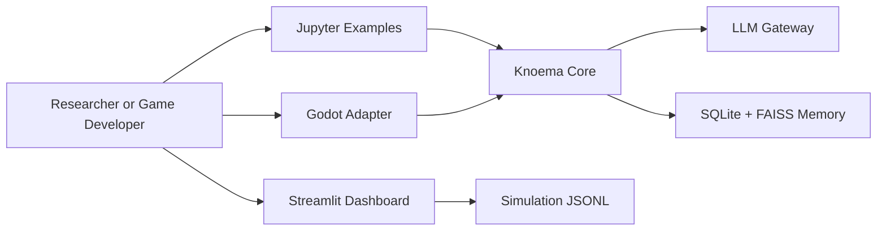
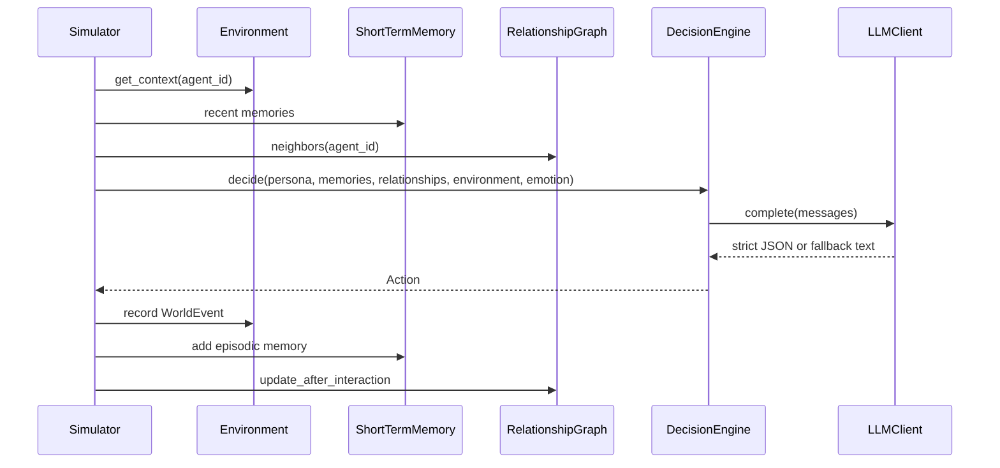

# Knoema Engine Architecture

Knoema Engine is a Python runtime for LLM-based multi-agent social simulation. The MVP keeps the core engine small and adapter-friendly: game engines, notebooks, and dashboards consume the same `Action` and JSONL log surface.

## Goals

- Model agents with stable persona, memory, relationship, emotion, and environment context.
- Keep local demos deterministic through `LocalClient`.
- Allow provider-backed runs through a single LLM gateway.
- Export replayable logs for notebooks, dashboards, and engine adapters.
- Keep public examples fictional and non-identifying.

## Non-Goals

- No crime prediction or suspect scoring.
- No production authentication, billing, or hosted SaaS in the MVP.
- No dependency on a specific game engine runtime.

## Runtime Context



## Building Blocks

| Module | Responsibility |
| --- | --- |
| `types.py` | Shared dataclasses: `Personality`, `Emotion`, `Memory`, `Action`, `WorldEvent` |
| `persona.py` | Persona identity and system prompt rendering |
| `prompts.py` | English, Korean, Japanese, and Chinese prompt templates |
| `memory/short_term.py` | FIFO recent memory buffer |
| `memory/long_term.py` | SQLite metadata plus FAISS vector retrieval, batch inserts, and semantic-temporal reranking |
| `memory/summarizer.py` | Compression from event streams to semantic memories |
| `relationship.py` | Directed relationship graph over agents |
| `environment.py` | Time, location, conditions, and recent event context |
| `emotion.py` | PAD emotion state and decay |
| `llm/` | Anthropic, OpenAI, local client, and fallback gateway |
| `decision.py` | Prompt construction and action parsing |
| `events/` | Scheduler and dispatcher |
| `simulator.py` | Main tick loop, action recording, JSONL export |
| `cli.py` | YAML-driven command line runner for local simulations |
| `dashboard/components/realtime_view.py` | Streamlit playback, live-tail, and tick summary helpers |

## Simulation Flow



## Data Persistence

The MVP uses two persistence formats:

- SQLite stores long-term memory metadata and text.
- FAISS stores deterministic hash embeddings for local retrieval.
- Hybrid reranking combines semantic similarity, temporal recency, and memory importance; `retrieve_with_scores(...)` exposes diagnostics for analysis.
- JSONL stores simulation actions for replay, notebooks, dashboards, and adapters.

`runs/`, `logs/`, SQLite databases, FAISS indexes, and checkpoints are ignored by git.

## Adapter Boundaries

Adapters should depend on the stable action surface:

```json
{
  "agent_id": "npc_ara",
  "action_type": "speak",
  "target": "player_rin",
  "content": "Welcome back, Rin.",
  "location": "Game World > North Harbor > Clinic"
}
```

The Godot scaffold currently demonstrates a thin HTTP/local fallback client. Future adapters should keep engine-specific rendering separate from simulation state.

## Quality Gates

Current verification commands:

```bash
pytest
ruff check .
mypy src
```

Notebook examples are executed with `jupyter nbconvert --execute`.
